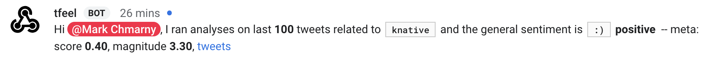

# twfeel - the on-demand topic sentiment provider

> WIP: Twitter is currently only data source provider

## Demo

`twfeel` can be demoed using either:

* REST Service
* Hangouts Chat

### REST Service

> Note, you will have to obtain the know invocator token (`token`) to execute this query either in browser or from command line

```shell
curl -H "Content-Type: application/json" -X GET \
		"https://twfeel.demo.knative.tech/v1/feel/knative?token=${TW_FEEL_TOKEN}" \
		| jq "."
```

### Hangouts Chat



Assuming the `@tfeel` bot has already been configured, you can use it either in direct messages (`DM`) by typing the name of topic

```shell
knative
```

or invite it to any chat room and ask the bot in your message

```shell
@tfeel knative
```

### Slack


Assuming the `@kfeel` app has already been added to your Slack instance, you can use it like this

```shell
/kfeel knative
```


## Setup

For information on how to install [Knative](https://knative.dev) see [how to](https://github.com/knative/docs/blob/master/install/README.md) on Knative site

### Deploy Service

First you will need to obtain Twitter API keys and create secrets

```shell
kubectl create secret generic twfeel-secrets -n demo \
	--from-literal=ACCESS_TOKEN=${TW_FEEL_TOKEN} \
	--from-literal=REDIS_PASS=${REDIS_PASS} \
	--from-literal=T_CONSUMER_KEY=${TK_CONSUMER_KEY} \
	--from-literal=T_CONSUMER_SECRET=${TK_CONSUMER_SECRET} \
	--from-literal=T_ACCESS_TOKEN=${TK_ACCESS_TOKEN} \
	--from-literal=T_ACCESS_SECRET=${TK_ACCESS_SECRET}
```

> Note, if you changed any of the variable above, you will need to edit the Knative service manifest in `config/service.yaml`

Then deploy the service


```shell
kubectl apply -f config/service.yaml
```


### Chat Bot

In the Google API Console, enable the Hangouts Chat API by doing the following:

* In the navigation, click APIs & Services > Dashboard.
* In the Dashboard, click Enable APIs and Services.
* Search for "Hangouts Chat API" and enable the API.

Once the API is enabled, click the Configuration tab. In the Configuration pane, do the following:

* In the Bot name field, enter 'YOUR_NAME'.
* In the Avatar URL field, enter 'https://github.com/mchmarny/twfeel/raw/master/icon.png'.
* In the Description field, enter 'Tweet sentimenter'.
* Under Functionality, select Bot works in direct messages and room
* Under Connection settings, select Bot URL and paste the URL for the Knative service
* Set the Permissions for all in the room

When you've finished configuring your bot, click Save Changes.


